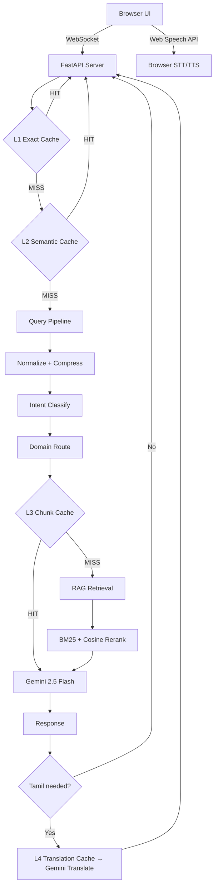

# AI Admissions Counselor — Veltech Multitech Engineering College

## Goal

Build a production-ready AI Admissions Counselor web application with voice + text support, Tamil/English bilingual capability, domain-sharded RAG, multi-layer caching, and Gemini 2.5 Flash as the LLM backbone.

---

## User Review Required

> [!IMPORTANT]
> **Gemini API Key**: You will need a valid Google Gemini API key. The app will prompt for it on first run or read from a `.env` file.

> [!IMPORTANT]
> **Embedding Model Change**: The spec mentions `text-embedding-004` but it has been **deprecated and shut down** (Jan 2026). We will use `gemini-embedding-001` instead.

> [!WARNING]
> **Redis Dependency**: The full spec calls for Redis for L1/L3/L4 caches. To keep this **immediately runnable without external services**, I propose using **in-memory Python caches** (dict + TTL) that mirror the Redis interface. This means the app runs standalone with `pip install` only — no Docker/Redis needed. The cache module will have a clean interface so Redis can be swapped in later.

> [!WARNING]
> **Voice (STT/TTS)**: Browser Web Speech API has reasonable Tamil support on Chrome but is unreliable elsewhere. I'll use the **browser-native Web Speech API** for STT and **SpeechSynthesis API** for TTS as the primary path, with a clear fallback message if unsupported.

> [!IMPORTANT]
> **Knowledge Base**: Since we don't have actual college data files, I will create a comprehensive **seed knowledge base** (JSON files) for all 17 domains using the research data gathered. This gives a working demo that can be replaced with real data.

---

## Architecture Overview



---

## Technology Stack

| Component | Technology | Rationale |
|---|---|---|
| **Backend** | FastAPI + Uvicorn | Async, WebSocket native, production-grade |
| **LLM** | Gemini 2.5 Flash (`google-genai`) | As specified, streaming support |
| **Embeddings** | `gemini-embedding-001` | Replaces deprecated `text-embedding-004` |
| **Vector Store** | FAISS (`faiss-cpu`) | Local, no external service needed |
| **Keyword Search** | `rank-bm25` | BM25 scoring for hybrid retrieval |
| **L1/L3/L4 Cache** | In-memory dict with TTL | Redis-compatible interface, zero deps |
| **L2 Semantic Cache** | FAISS index | Cosine similarity ≥ 0.92 threshold |
| **Frontend** | HTML + Vanilla CSS + JS | Premium glassmorphism UI, no framework |
| **Voice** | Web Speech API (browser) | STT + TTS, Tamil support on Chrome |
| **Translation** | Gemini Flash (reuse model) | Tamil ↔ English via prompt |

---

## Project Structure

```
c:\Project Hub\MP\
├── .env                          # GEMINI_API_KEY
├── requirements.txt
├── run.py                        # Entry point
├── server/
│   ├── __init__.py
│   ├── app.py                    # FastAPI app + routes
│   ├── config.py                 # All configuration constants
│   ├── cache/
│   │   ├── __init__.py
│   │   ├── l1_exact.py           # L1 exact match (SHA-256 key)
│   │   ├── l2_semantic.py        # L2 FAISS semantic cache
│   │   ├── l3_chunk.py           # L3 RAG chunk cache
│   │   └── l4_translation.py    # L4 translation cache
│   ├── pipeline/
│   │   ├── __init__.py
│   │   ├── language.py           # Language detection + translation
│   │   ├── normalizer.py         # Query normalization + compression
│   │   ├── intent.py             # Intent classification
│   │   └── domain_router.py     # Domain routing to correct shard
│   ├── rag/
│   │   ├── __init__.py
│   │   ├── embeddings.py         # Gemini embedding wrapper
│   │   ├── vector_store.py       # FAISS index management (per domain)
│   │   ├── bm25_store.py         # BM25 index (per domain)
│   │   ├── retriever.py          # Hybrid retrieval + reranking
│   │   └── knowledge_loader.py  # Load JSON KB → FAISS + BM25
│   ├── llm/
│   │   ├── __init__.py
│   │   └── gemini.py             # Gemini 2.5 Flash client (streaming)
│   └── logger.py                 # Async interaction logging
├── knowledge/                    # Seed knowledge base (17 domains)
│   ├── 01_basic_info.json
│   ├── 02_courses.json
│   ├── 03_admission.json
│   ├── 04_fees.json
│   ├── 05_infrastructure.json
│   ├── 06_labs.json
│   ├── 07_placements.json
│   ├── 08_hostel.json
│   ├── 09_sports.json
│   ├── 10_clubs.json
│   ├── 11_events.json
│   ├── 12_faculty.json
│   ├── 13_industry.json
│   ├── 14_transport.json
│   ├── 15_health_safety.json
│   ├── 16_rankings.json
│   └── 17_contact.json
├── static/
│   ├── index.html                # Main UI
│   ├── style.css                 # Premium glassmorphism CSS
│   ├── app.js                    # Frontend logic + WebSocket + Voice
│   └── assets/
│       └── logo.png              # College logo (generated)
└── logs/
    └── interactions.jsonl        # Async log output
```

---

## Proposed Changes

### Phase 1: Foundation & Configuration

#### [NEW] [.env](file:///c:/Project%20Hub/MP/.env)
- Template for `GEMINI_API_KEY`

#### [NEW] [requirements.txt](file:///c:/Project%20Hub/MP/requirements.txt)
- `fastapi`, `uvicorn[standard]`, `google-genai`, `faiss-cpu`, `rank-bm25`, `numpy`, `python-dotenv`

#### [NEW] [config.py](file:///c:/Project%20Hub/MP/server/config.py)
- All MODULE 1 settings (model, temperature, max_tokens)
- Cache TTL values from MODULE 2
- RAG config from MODULE 5 (top_k, chunk_size, overlap)
- Latency targets from MODULE 11
- Domain shard mapping from MODULE 6

#### [NEW] [run.py](file:///c:/Project%20Hub/MP/run.py)
- Entry point: loads env, starts uvicorn

---

### Phase 2: Caching Layer (MODULE 2)

#### [NEW] [l1_exact.py](file:///c:/Project%20Hub/MP/server/cache/l1_exact.py)
- SHA-256 keyed dict cache with TTL (60 min)
- `normalize(query) + intent` as key input
- Thread-safe with asyncio locks

#### [NEW] [l2_semantic.py](file:///c:/Project%20Hub/MP/server/cache/l2_semantic.py)
- Separate FAISS `IndexFlatIP` for cached query embeddings
- Cosine similarity threshold ≥ 0.92
- Maps embedding → cached response
- TTL: 24hr, invalidation on KB update

#### [NEW] [l3_chunk.py](file:///c:/Project%20Hub/MP/server/cache/l3_chunk.py)
- `domain + compressed_query_hash` keyed cache
- Stores retrieved + scored chunks
- TTL: 4hr

#### [NEW] [l4_translation.py](file:///c:/Project%20Hub/MP/server/cache/l4_translation.py)
- `SHA-256(source_text + lang_pair)` keyed cache
- TTL: 12hr
- Exclusion list: proper nouns, course names, amounts

---

### Phase 3: Pipeline (MODULES 3 & 4)

#### [NEW] [language.py](file:///c:/Project%20Hub/MP/server/pipeline/language.py)
- Language detection using character range analysis (Tamil Unicode block U+0B80–U+0BFF)
- Translation via Gemini Flash with preservation rules (course names, numbers, URLs, acronyms)
- L4 cache integration

#### [NEW] [normalizer.py](file:///c:/Project%20Hub/MP/server/pipeline/normalizer.py)
- Lowercase, strip punctuation, remove fillers
- Contraction expansion
- Query compression to 3–6 keywords (Gemini-based or rule-based)

#### [NEW] [intent.py](file:///c:/Project%20Hub/MP/server/pipeline/intent.py)
- Keyword-based classifier with confidence scoring
- 13 intent labels from spec
- Threshold: 0.70, fallback to "general"

#### [NEW] [domain_router.py](file:///c:/Project%20Hub/MP/server/pipeline/domain_router.py)
- Maps intent → domain shard(s)
- Uses keyword overlap + intent label mapping
- Returns primary domain + optional secondary

---

### Phase 4: RAG Engine (MODULE 5)

#### [NEW] [embeddings.py](file:///c:/Project%20Hub/MP/server/rag/embeddings.py)
- Wrapper around `gemini-embedding-001`
- Batch embedding support
- L2 normalize for cosine similarity

#### [NEW] [vector_store.py](file:///c:/Project%20Hub/MP/server/rag/vector_store.py)
- Per-domain FAISS `IndexFlatIP` indices
- Load/save to disk for persistence
- Top-k retrieval with score threshold

#### [NEW] [bm25_store.py](file:///c:/Project%20Hub/MP/server/rag/bm25_store.py)
- Per-domain BM25 indices using `rank-bm25`
- Tokenized document storage

#### [NEW] [retriever.py](file:///c:/Project%20Hub/MP/server/rag/retriever.py)
- Hybrid retrieval: `0.5 × BM25 + 0.5 × cosine`
- Top-3 by combined score
- Confidence threshold filter (< 0.5 → discard)
- Grounding enforcement

#### [NEW] [knowledge_loader.py](file:///c:/Project%20Hub/MP/server/rag/knowledge_loader.py)
- Parse JSON KB files → chunk (200–300 tokens, 40 overlap)
- Build FAISS + BM25 indices per domain
- Pre-populate L2 cache with top-50 FAQ embeddings

---

### Phase 5: LLM Integration (MODULE 7 & 8)

#### [NEW] [gemini.py](file:///c:/Project%20Hub/MP/server/llm/gemini.py)
- Gemini 2.5 Flash client with streaming
- System prompt encoding all MODULE 7 behavior rules
- Response format enforcement (MODULE 8)
- Strict grounding: only use provided chunks

---

### Phase 6: Main Application

#### [NEW] [app.py](file:///c:/Project%20Hub/MP/server/app.py)
- FastAPI app with:
  - `GET /` → serve static UI
  - `POST /api/chat` → text chat endpoint
  - `WebSocket /ws/chat` → streaming voice/text
  - `GET /api/health` → health check
- Full pipeline orchestration (MODULE 9):
  1. Language detect → L1 check → translate → normalize → intent → L2 check → domain route → L3 check → RAG → Gemini → cache write → back-translate → respond

#### [NEW] [logger.py](file:///c:/Project%20Hub/MP/server/logger.py)
- Async JSONL logger (MODULE 10)
- Fields: session_id, intent, domain, cache_layer_hit, resolution_status, escalated, timestamp, response_ms

---

### Phase 7: Knowledge Base

#### [NEW] 17 domain JSON files in `knowledge/`
- Comprehensive seed data for all domains using research:
  - Courses: B.Tech (CSE, AI&DS, IT, ECE, Mech, BME, CSBS), M.Tech, lateral entry
  - Fees: ₹1.5L–3.6L UG, ₹50K–1.7L PG, hostel ₹90K–1.1L/yr
  - Placements: 75–80%, avg ₹3–4.5 LPA, top recruiters (TCS, Infosys, Wipro, Zoho, etc.)
  - Infrastructure, labs, sports, clubs, events, faculty, transport, health, rankings, contact

> [!NOTE]
> Each JSON file contains an array of chunks, each with `id`, `text`, `keywords`, and `metadata` fields. Chunks are pre-sized to 200–300 tokens.

---

### Phase 8: Frontend UI

#### [NEW] [index.html](file:///c:/Project%20Hub/MP/static/index.html)
- Semantic HTML5 structure
- Chat interface with message bubbles
- Voice input/output toggle button
- Language indicator (Tamil/English)
- Session info display

#### [NEW] [style.css](file:///c:/Project%20Hub/MP/static/style.css)
- **Dark mode** glassmorphism design
- Color palette: Deep navy (#0a0e27) → Electric blue (#4f46e5) → Cyan accents (#06b6d4)
- Google Fonts: Inter
- Frosted glass panels with `backdrop-filter: blur()`
- Smooth message animations (slide-in, fade)
- Typing indicator with bouncing dots
- Responsive layout (mobile-first)
- Voice button with pulsing animation when recording
- Premium scrollbar styling

#### [NEW] [app.js](file:///c:/Project%20Hub/MP/static/app.js)
- WebSocket connection management
- Web Speech API integration (STT + TTS)
- Language detection indicator
- Message rendering with markdown-lite
- Auto-scroll, session management
- Voice recording state with visual feedback
- Streaming response display
- Error handling with graceful fallbacks

---

## Open Questions

> [!IMPORTANT]
> **1. API Key**: Do you already have a Gemini API key, or should the app show an input field for it on the UI?

> [!IMPORTANT]
> **2. Real Knowledge Data**: The seed knowledge base uses publicly available data. Do you have official college data (PDFs, docs, spreadsheets) that should be used instead?

> [!IMPORTANT]
> **3. Redis vs In-Memory**: Should I proceed with in-memory caching (zero-dependency, runs instantly) or do you want actual Redis integration (requires Redis server running)?

---

## Verification Plan

### Automated Tests
1. **Server starts**: `python run.py` launches without errors
2. **Health check**: `GET /api/health` returns 200
3. **Text chat**: POST a query and verify RAG-grounded response
4. **Tamil detection**: Send Tamil text, verify Tamil response
5. **Cache layers**: Send duplicate query, verify L1 cache hit
6. **Intent classification**: Test queries for each intent label
7. **Domain routing**: Verify correct domain shard selection

### Browser Tests
1. Open UI → verify glassmorphism design renders correctly
2. Type a query → verify streaming response in chat
3. Click voice button → verify STT captures speech
4. Send Tamil query → verify Tamil response
5. Verify mobile responsive layout
6. Test error states (no API key, invalid query)

### Performance Validation
- L1 cache hit: measure < 50ms
- Full RAG pipeline: measure < 1500ms
- Verify streaming starts within 500ms
